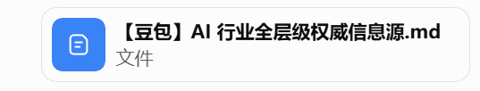

【提示词】

这是一份豆包给我的答案，请基于这份文档，帮我重新搜集AI行业权威的信息源，包括国内国外，重新生成一份类似的markdown文档给我


# AI 行业权威信息源全景清单（国内 + 海外）

> **版本：2026-06-30**  
> **用途：** AI 行业研究、竞争情报、产品分析、投融资研究、政策合规、技术选型与内容选题。  
> **核心原则：** 不按“名气”判断权威性，而按其能提供的**证据类型**判断；厂商官方、独立测评、商业数据库、新闻媒体和个人观点必须分开使用。

---

## 一、先看结论：怎样判断一个 AI 信源是否“权威”

同一个来源可能在一个问题上很权威，在另一个问题上却不适合作为证据。例如：

- 厂商官网是产品参数、价格、API 文档和安全报告的第一手来源，但不是证明“自家模型行业第一”的独立证据；
- arXiv 是追踪前沿论文的最佳入口之一，但论文多数尚未经过正式同行评审；
- Gartner、IDC、PitchBook 等适合做市场估算和趋势比较，但其统计口径、样本和模型往往是商业方法论，不等同于官方统计；
- 媒体适合确认事件、获得访谈和行业背景，但市场规模、模型能力与安全结论应继续追溯到原始报告、论文、监管文件或可复现实验。

### 证据等级

|等级/标签|来源类型|可用于证明|不能单独用于证明|典型来源|
|---|---|---|---|---|
|S：原始权威|法律法规、监管公告、国家/国际标准、交易所披露、正式论文与原始数据|政策要求、合规边界、标准条文、公司法定披露、研究原始结论|产品实际体验、市场口碑、未经披露的商业数据|中国政府网、国家网信办、NIST、EU AI Office、ISO、SEC、顶会论文|
|A：独立研究/测评|高校、非营利研究机构、透明可复现评测|模型能力、安全风险、长期趋势、可比较指标|所有现实场景表现；单一榜单不能代表综合能力|Stanford AI Index、HELM、MLCommons、METR、OpenCompass|
|B：商业数据库/咨询|市场研究、流量、投融资、移动应用与企业数据库|市场估算、用户规模、下载量、融资与公司画像|官方统计意义上的确定值；不同机构口径不可直接混用|IDC、Gartner、PitchBook、Dealroom、Sensor Tower、QuestMobile|
|C：高信誉媒体|通讯社、财经媒体、科技媒体、深度报道|事件确认、访谈、产业脉络、公司动态|模型性能、安全性、市场规模等需要原始证据的问题|Reuters、FT、财新、晚点、机器之心|
|D：专家/社区/自媒体|专家通讯、播客、社区、垂直公众号|观点、早期线索、产品体验、研究解读|政策、财务、市场规模和安全结论的唯一依据|The Batch、Import AI、Interconnects、Datawhale|
|F：厂商第一方|模型厂商、云厂商、芯片厂商官方渠道|自家版本、定价、参数、API、发布日期、模型卡和安全材料|竞品比较、市场地位、第三方效果与客户收益|OpenAI、Anthropic、Google DeepMind、DeepSeek、阿里云、百度智能云|


### 建议的采信顺序

1. **政策、监管、标准：** 只引用 S 级原文，并记录发布日期、实施日期和适用地区。
2. **模型能力：** F 级模型卡/技术报告 + 至少一个 A 级独立评测 + 自己的场景测试。
3. **市场规模：** B 级至少两家机构交叉验证，并对统计口径、地域、时间段、是否含硬件进行说明。
4. **公司经营与融资：** 优先交易所/监管披露；私营公司再参考 PitchBook、Dealroom、IT 桔子等。
5. **突发新闻：** 先用 C 级媒体确认，再回到公司公告、监管文件、论文或代码仓库。

---

## 二、国内：政策、监管、标准与国家级研究平台

|级别|机构|定位|官方入口|最适合回答|使用边界|
|---|---|---|---|---|---|
|S|中国政府网|中央政策与国务院文件|[政策栏目](https://www.gov.cn/zhengce/)|法律政策原文、国务院文件、部委政策汇总|以正式发布页面和附件为准；注意发布日期与实施日期|
|S|国家互联网信息办公室|AI 内容治理、算法、深度合成、生成式 AI、备案与执法|[官网](https://www.cac.gov.cn/)|生成式 AI、算法推荐、深度合成、内容标识、备案公告|政策解读不能替代办法、规定和公告原文|
|S|工业和信息化部|AI 产业、算力、软件、通信与标准化政策|[官网](https://www.miit.gov.cn/)|产业政策、试点名单、标准化指南、算力与制造业 AI|产业规模数据应核对统计范围和牵头单位|
|S|科学技术部|国家科技计划与人工智能科研政策|[官网](https://www.most.gov.cn/)|科研专项、伦理治理、科技成果与项目管理|项目新闻不等同于成果已验证|
|S|国家发展和改革委员会|宏观产业政策、基础设施与重大工程|[官网](https://www.ndrc.gov.cn/)|人工智能+、数据基础设施、区域产业政策|地方落地情况需再查地方政府文件|
|S|国家数据局|数据基础制度、数据要素与公共数据|[官网](https://www.nda.gov.cn/)|训练数据、数据流通、公共数据开发利用、数据基础设施|涉及个人信息仍需结合网信、公安及相关法律|
|S|国家市场监督管理总局|国家标准、市场监管、反垄断与产品质量|[官网](https://www.samr.gov.cn/)|强制性国家标准、监管公告、经营合规|技术标准全文优先到国家标准系统核验|
|S|国家标准全文公开系统|国家标准检索与标准文本|[标准检索](https://openstd.samr.gov.cn/)|确认标准编号、状态、发布日期和实施日期|部分标准全文可能受版权或访问限制|
|S|全国网络安全标准化技术委员会（TC260）|网络安全、数据安全与 AI 安全标准|[官网](https://www.tc260.org.cn/)|生成式 AI 安全要求、内容标识、AI 安全治理框架|工作组文件、征求意见稿与已发布标准必须区分|
|A/S|中国信息通信研究院（CAICT）|ICT 与 AI 产业研究、可信 AI 测评|[官网](https://www.caict.ac.cn/) / [AIHub](https://aihub.caict.ac.cn/)|白皮书、产业观察、标准研究、可信 AI 评估|白皮书中的市场数据需查看样本与统计方法|
|A|中国电子信息产业发展研究院（赛迪研究院）|电子信息、工业 AI、算力与产业政策|[官网](https://www.ccidgroup.com/)|产业链、区域布局、工业与政企 AI|研究报告与商业榜单需区分|
|A|中国计算机学会（CCF）|学术共同体、会议评价与技术趋势|[官网](https://www.ccf.org.cn/)|学术会议、专家观点、技术路线、人才与科研生态|专家观点不等同于机构统一结论|
|A|中国人工智能学会（CAAI）|人工智能学术交流、产业与伦理|[官网](https://www.caai.cn/)|学术会议、奖项、专业委员会与行业交流|会议宣传材料需追溯论文或报告|
|A|北京智源人工智能研究院（BAAI）|基础模型、开源研究与评测|[官网](https://www.baai.ac.cn/)|大模型研究、开源模型、智源大会与研究报告|机构自研模型的性能仍需独立评测|
|A|上海人工智能实验室|基础模型、科学智能、评测与开放平台|[官网](https://www.shlab.org.cn/)|OpenCompass、模型研究、具身智能和科学智能|实验室自研成果与第三方测评需区分|


### 2026 年特别需要持续关注的国内政策入口

- 国家网信办的生成式人工智能服务备案与登记公告；
- 人工智能生成合成内容标识相关强制性国家标准及配套指南；
- 2026 年发布、并于 **2026 年 7 月 15 日**起施行的人工智能拟人化互动服务管理规则；
- “人工智能+”行动、行业应用试点和数据基础设施政策；
- TC260 人工智能安全标准工作组与后续国家标准项目。

---

## 三、海外：监管、标准与治理机构

|级别|机构|地区|定位|官方入口|最适合回答|使用边界|
|---|---|---|---|---|---|---|
|S|European Commission — AI Office|欧盟|AI Act 执行、通用人工智能规则与实施指南|[AI Office](https://digital-strategy.ec.europa.eu/en/policies/ai-office)|欧盟 AI Act 的实施、GPAI 规则、行为准则和监管更新|
|S|EU AI Act Service Desk|欧盟|AI Act 官方文本、时间线和适用义务查询|[Service Desk](https://ai-act-service-desk.ec.europa.eu/)|判断某类系统何时适用哪些义务|不能替代专业法律意见|
|S|NIST AI Risk Management Framework|美国|AI 风险管理框架与生成式 AI 配套文件|[AI RMF](https://www.nist.gov/itl/ai-risk-management-framework)|企业治理、风险分类、控制措施与评估框架|
|S/A|NIST Center for AI Standards and Innovation（CAISI）|美国|AI 安全、标准、评测和国际协作|[CAISI](https://www.nist.gov/caisi)|前沿模型测试、代理标准、测量科学与安全研究|
|S/A|UK AI Security Institute（AISI）|英国|前沿模型安全评测与研究|[官网](https://www.aisi.gov.uk/)|能力风险、保障措施、评测工具与安全研究|
|A|Inspect Evaluation Framework|英国|开放的模型评测框架|[Inspect](https://inspect.aisi.org.uk/)|复现实验、构建评测任务与安全测试|框架本身不保证具体评测设计合理|
|S/A|OECD.AI Policy Observatory|国际|政策数据库、指标与国际比较|[OECD.AI](https://oecd.ai/)|各国 AI 政策、定义、指标、治理框架|
|A|OECD AI Incidents Monitor|国际|AI 事件与风险案例监测|[AIM](https://oecd.ai/en/incidents)|安全事件、社会影响、风险案例与趋势|事件收录依赖公开报道，不代表完整统计|
|S|ISO/IEC JTC 1/SC 42|国际|人工智能国际标准化|[SC 42](https://www.iso.org/committee/6794475.html)|AI 管理体系、风险、数据质量、可信性与术语标准|标准正文通常需要购买或机构权限|
|S|UNESCO Recommendation on the Ethics of AI|国际|人工智能伦理国际规范|[伦理建议书](https://www.unesco.org/en/artificial-intelligence/recommendation-ethics)|伦理原则、政府治理与社会影响评估|
|S|Council of Europe Framework Convention on AI|欧洲/国际|人工智能、人权、民主与法治条约框架|[公约入口](https://www.coe.int/en/web/artificial-intelligence/the-framework-convention-on-artificial-intelligence)|人权影响、公共部门治理与国际法律框架|
|A/S|AI Verify Foundation / IMDA|新加坡|AI 治理测试框架和工具|[AI Verify Foundation](https://aiverifyfoundation.sg/) / [IMDA](https://www.imda.gov.sg/)|企业 AI 治理、测试工具、模型治理与行业实践|
|A|Center for Security and Emerging Technology（CSET）|美国|AI、算力、芯片、人才和国家安全研究|[官网](https://cset.georgetown.edu/)|政策研究、供应链、人才与国家竞争分析|属于研究机构分析，不是监管文件|
|A|Ada Lovelace Institute|英国|AI 与数据治理、公共利益研究|[官网](https://www.adalovelaceinstitute.org/)|社会影响、问责、公共政策与治理框架|
|A|AI Now Institute|美国|AI 权力、劳动、公共政策与问责|[官网](https://ainowinstitute.org/)|社会影响、公共利益与批判性政策研究|具有明确研究立场，应与其他观点交叉阅读|


> **时间提醒：** 欧盟 AI Act 已于 2024 年 8 月 1 日生效，多项义务分阶段适用，主体规则预计在 2026 年 8 月 2 日进入更全面适用阶段；研究具体业务时应以官方时间线和最新实施文件为准。

---

## 四、学术论文、顶会与研究检索

|级别|平台|类型|入口|最适合回答|使用边界|
|---|---|---|---|---|---|
|S（预印本）|arXiv|预印本仓库|[arXiv](https://arxiv.org/)|最快追踪新论文和技术报告|多数内容尚未同行评审；需查看版本、作者和后续发表状态|
|S/A|OpenReview|开放同行评审平台|[OpenReview](https://openreview.net/)|ICLR 等会议投稿、评审意见、作者回复与最终决定|被提交不等于被接收；注意匿名稿和最终版本|
|S|ACL Anthology|自然语言处理论文库|[ACL Anthology](https://aclanthology.org/)|ACL、EMNLP、NAACL、COLING 等正式论文|会议主会、Findings、Workshop 的审稿强度不同|
|S|NeurIPS Proceedings|机器学习顶会论文|[Proceedings](https://proceedings.neurips.cc/)|机器学习、基础模型与优化等正式论文|会议论文仍需看实验设计与可复现性|
|S|PMLR|机器学习会议论文集|[PMLR](https://proceedings.mlr.press/)|ICML、AISTATS、CoRL 等正式论文|不同会议和专题卷的评审标准不同|
|S|ICLR Proceedings|表示学习顶会论文|[ICLR on OpenReview](https://openreview.net/group?id=ICLR.cc)|论文、评审、作者回复与接收情况|以最终接收列表和 camera-ready 版本为准|
|S|CVF Open Access|计算机视觉论文库|[CVF](https://openaccess.thecvf.com/)|CVPR、ICCV、ECCV 等视觉论文|榜单性能需核对数据泄漏、训练数据和测试协议|
|S|JMLR|机器学习期刊|[JMLR](https://www.jmlr.org/)|经过期刊审稿的机器学习研究|发表周期较长，不适合只追求最新进展|
|A|Semantic Scholar|学术搜索与引用图谱|[Semantic Scholar](https://www.semanticscholar.org/)|查找论文、作者、引用关系和相关工作|自动摘要和影响力指标不能替代阅读全文|
|A|DBLP|计算机科学文献目录|[DBLP](https://dblp.org/)|确认作者、会议、期刊和出版信息|主要是索引，不提供研究质量判断|
|A|Crossref|DOI 与出版元数据|[Crossref](https://search.crossref.org/)|核验 DOI、期刊、出版时间和版本|元数据完整性取决于出版方|
|D/A|Hugging Face Daily Papers|论文发现与社区讨论|[Daily Papers](https://huggingface.co/papers)|快速发现近期热门论文、模型和社区讨论|热度不等于学术质量；仍需回到论文和代码|
|A|AMiner|学术搜索与科技情报|[AMiner](https://www.aminer.cn/)|作者画像、研究趋势、论文和机构分析|自动生成的标签和排名需要人工核验|
|B/A|中国知网（CNKI）|中文学术数据库|[CNKI](https://www.cnki.net/)|中文政策研究、行业论文、硕博论文和期刊|论文质量差异大，需看期刊、方法和引用|


### 论文阅读的最低核验清单

- 论文是否为预印本、已接收会议论文，还是正式期刊论文；
- 训练数据、测试集、基线模型、计算预算和统计显著性是否公开；
- 是否存在数据污染、挑选性报告、提示词优化不公平或测试集过时；
- 是否有代码、模型权重、复现实验或独立复核；
- 结论是否只在某个基准成立，却被扩大成通用能力结论。

---

## 五、独立评测、模型榜单、安全与趋势数据库

|级别|平台|定位|入口|最适合回答|使用边界|
|---|---|---|---|---|---|
|A|Stanford AI Index|全球年度 AI 指数|[AI Index](https://aiindex.stanford.edu/)|研发、投资、人才、政策、成本、采用率与社会影响|年度汇总有时间滞后；指标口径应查看方法附录|
|A|Stanford HELM|基础模型整体评测|[HELM](https://crfm.stanford.edu/helm/)|多场景、多指标和透明评测|覆盖范围仍有限，不能代替企业私有数据测试|
|A|MLCommons / MLPerf|训练、推理与系统性能基准|[MLCommons](https://mlcommons.org/)|硬件与系统性能、能效和标准化测试|提交结果受规则约束，但不代表所有真实工作负载|
|A|METR|前沿模型任务能力与风险研究|[METR](https://metr.org/)|长任务、自主能力、研发加速与风险评测|研究重点偏前沿模型和特定任务，外推需谨慎|
|A|Epoch AI|计算、数据、模型与能力趋势|[Epoch AI](https://epoch.ai/)|训练算力、模型规模、算法进步和长期趋势|部分数据为估计值，应查看假设和置信区间|
|A/B|LMArena|匿名人类偏好对战|[LMArena](https://lmarena.ai/)|通用对话偏好和模型相对表现|受用户群、提示分布、版本漂移和风格偏好影响|
|A/B|Artificial Analysis|模型质量、速度和价格比较|[Artificial Analysis](https://artificialanalysis.ai/)|API 价格、输出速度、上下文和综合指数|属于第三方商业评测；应核对方法、日期和模型版本|
|A|SWE-bench|真实 GitHub 软件工程任务|[SWE-bench](https://www.swebench.com/)|代码代理修复真实 issue 的能力|结果高度依赖代理框架、工具、预算和测试设置|
|A|LiveBench|动态更新的语言模型评测|[LiveBench](https://livebench.ai/)|降低测试集污染、比较近期模型|仍是有限任务集合，不能等同于真实业务效果|
|A|OpenCompass|大模型开源评测体系|[OpenCompass](https://opencompass.org.cn/)|中文与多语言模型、能力维度、评测工具|需确认模型版本、推理参数、数据污染和评测时间|
|A|CompassArena|中文模型竞技场|[CompassArena](https://compassarena.org.cn/)|中文对话偏好、人类评测与模型比较|人类偏好不等于事实准确、安全性或专业能力|
|A|FlagEval（天秤）|多维度模型评测平台|[FlagEval](https://flageval.baai.ac.cn/)|中文大模型、能力、安全与多任务评估|不同版本和赛道不可直接横向拼接|
|A|C-Eval|中文综合知识评测|[GitHub](https://github.com/hkust-nlp/ceval)|中文学科知识和考试型能力|题库固定，可能被训练数据污染；不代表工作能力|
|A/S|CAICT 可信 AI 评估|国内可信 AI 标准与测评|[AIHub](https://aihub.caict.ac.cn/)|功能、性能、安全、治理和行业能力评估|认证/测评范围应查看具体项目和版本|
|A|AI Incident Database|AI 事故与事件数据库|[数据库](https://incidentdatabase.ai/)|安全事件、现实伤害、风险模式和案例检索|事件定义、去重和报道偏差需关注|


### 榜单使用规范

- 不使用“总榜第一”作为采购结论；按业务拆成准确性、延迟、价格、稳定性、隐私、安全和工具调用等维度。
- 记录模型的**完整版本号、测试日期、API/开源权重、推理参数、上下文长度和代理框架**。
- 至少保留一套不公开的内部测试集，避免公开基准被过拟合。
- 对排行榜差异较小的模型，优先做盲测和成本/延迟测试，而不是放大微小分差。

---

## 六、模型厂商与基础设施厂商：官方第一手来源

> 本节统一标为 **F（First-party）**。它们是自家产品事实的原始来源，但不能替代独立测评和第三方市场证据。

### 6.1 国内厂商

|厂商|官方入口|开发者/产品文档|可确认的事实|必须补充的证据|
|---|---|---|---|---|
|DeepSeek|[官网](https://www.deepseek.com/)|[API 文档](https://api-docs.deepseek.com/)|模型发布、技术报告、API 价格和服务状态|性能结论需与 OpenCompass、LMArena、内部测试交叉验证|
|阿里云 / 通义千问 Qwen|[Qwen](https://qwenlm.github.io/) / [阿里云](https://www.aliyun.com/)|[百炼 Model Studio](https://help.aliyun.com/zh/model-studio/)|开源模型、云 API、企业部署和生态工具|区分开源权重、云端版本和不同发布日期|
|百度智能云 / 文心|[百度智能云](https://cloud.baidu.com/)|[千帆大模型平台](https://cloud.baidu.com/product/wenxinworkshop)|文心模型、企业平台、行业方案和定价|客户案例通常为厂商叙述，需核对客户披露与效果口径|
|腾讯混元|[混元](https://hunyuan.tencent.com/)|[腾讯云文档](https://cloud.tencent.com/document/product/1729)|模型版本、腾讯云 API、多模态与应用生态|腾讯元宝等 C 端产品数据需结合第三方流量数据|
|字节跳动 / 火山引擎豆包|[火山引擎](https://www.volcengine.com/)|[方舟平台](https://www.volcengine.com/product/ark)|豆包模型、云端推理、智能体和企业产品|区分豆包应用、模型服务和火山引擎产品|
|智谱 AI|[官网](https://www.zhipuai.cn/)|[BigModel 开放平台](https://www.bigmodel.cn/)|GLM 模型、API、智能体和企业服务|模型代际与 API 别名可能更新，引用时写明日期|
|Moonshot AI / Kimi|[Kimi](https://www.kimi.com/)|[开放平台](https://platform.moonshot.cn/docs)|长文本、模型 API、产品功能和价格|C 端使用量与留存需第三方数据验证|
|MiniMax|[官网](https://www.minimaxi.com/)|[开放平台](https://platform.minimaxi.com/)|文本、语音、视频、多模态模型和 API|不同产品线、地区和计费单位需分别核对|
|科大讯飞 / 讯飞星火|[科大讯飞](https://www.iflytek.com/)|[星火开放平台](https://xinghuo.xfyun.cn/)|教育、医疗、语音与行业大模型|行业案例效果需查看项目范围、基线和验收口径|
|华为云 / 盘古|[华为云](https://www.huaweicloud.com/)|[盘古大模型](https://www.huaweicloud.com/product/pangu.html)|行业大模型、国产算力、企业部署与解决方案|解决方案材料应与客户和招投标文件交叉核验|
|百川智能|[官网](https://www.baichuan-ai.com/)|[开放平台](https://platform.baichuan-ai.com/)|模型发布、API 和行业应用|官网版本、开放平台版本和开源版本需区分|


### 6.2 海外厂商

|厂商|官方研究/公告|开发者/模型资料|可确认的事实|必须补充的证据|
|---|---|---|---|---|
|OpenAI|[News / Research](https://openai.com/news/)|[开发者文档](https://platform.openai.com/docs/) / [定价](https://openai.com/api/pricing/)|模型/API 发布、产品能力、价格、系统卡与安全说明|与独立评测、实际 API 测试和服务条款交叉核验|
|Anthropic|[News](https://www.anthropic.com/news)|[Docs](https://docs.anthropic.com/) / [Transparency Hub](https://www.anthropic.com/transparency)|Claude 版本、API、模型卡、透明度和安全研究|厂商安全声明不等同于监管审计或独立验证|
|Google DeepMind / Gemini|[DeepMind](https://deepmind.google/)|[Gemini API](https://ai.google.dev/) / [Model Cards](https://modelcards.withgoogle.com/)|研究论文、Gemini 模型、开发者功能和模型卡|区分研究原型、消费产品和云 API 版本|
|Meta AI|[Meta AI](https://ai.meta.com/)|[Llama](https://www.llama.com/)|Llama 模型、研究、开源许可与生态|“开放”程度、许可证限制和部署成本需单独分析|
|Microsoft AI / Azure AI|[Microsoft AI](https://www.microsoft.com/en-us/ai)|[Azure AI 文档](https://learn.microsoft.com/azure/ai-services/)|Copilot、Azure AI、企业集成和安全能力|区分微软自研模型、合作模型和 Azure 托管服务|
|NVIDIA|[AI](https://www.nvidia.com/en-us/ai/)|[Developer](https://developer.nvidia.com/) / [Technical Blog](https://developer.nvidia.com/blog/)|GPU、软件栈、推理优化、参考架构与基准提交|厂商基准需核对硬件配置、精度、批量和功耗|
|Mistral AI|[News](https://mistral.ai/news/)|[Docs](https://docs.mistral.ai/)|模型发布、开放权重、API 和企业部署|不同许可证和托管方式需分别核验|
|Cohere|[Research](https://cohere.com/research)|[Docs](https://docs.cohere.com/)|企业语言模型、RAG、嵌入和 API|企业案例的收益需第三方或客户证据|
|Hugging Face|[Blog](https://huggingface.co/blog)|[Docs](https://huggingface.co/docs) / [Models](https://huggingface.co/models)|模型卡、权重、数据集、开源工具和社区活动|用户上传内容质量不一，必须核对作者、许可证和 commit|
|Amazon Web Services|[Machine Learning Blog](https://aws.amazon.com/blogs/machine-learning/)|[AWS AI/ML](https://aws.amazon.com/machine-learning/)|Bedrock、SageMaker、基础设施和客户案例|案例为厂商精选，成本需按真实负载测算|


### 厂商官方材料的四类可信度

1. **高：** API 文档、价格页、版本说明、服务条款、许可证、状态页。
2. **中高：** 模型卡、系统卡、技术报告；属于第一方披露，但通常包含方法和限制。
3. **中：** 官方博客、发布会演示、客户案例；适合确认发布事实，不宜直接采信效果结论。
4. **低：** “行业领先”“提升数倍”“大幅降本”等无公开口径的营销表述。

---

## 七、市场规模、用户流量、投融资与公司披露

|级别|来源|数据类型|入口|最适合回答|使用边界|
|---|---|---|---|---|---|
|S|国家统计局|中国宏观与行业统计|[官网](https://www.stats.gov.cn/)|宏观基准、就业、产业和经济数据|AI 细分统计有限，不能强行推算市场规模|
|S|国家企业信用信息公示系统|中国企业登记与信用|[官网](https://www.gsxt.gov.cn/)|公司主体、股东、行政处罚和经营异常|数据可能有更新延迟，复杂股权需结合工商数据库|
|S|巨潮资讯|中国上市公司法定披露|[官网](https://www.cninfo.com.cn/)|年报、公告、投资者关系、重大合同|公司对 AI 的定性表述仍需与财务数据对照|
|S|上海证券交易所|沪市公司披露|[官网](https://www.sse.com.cn/)|公告、问询回复、监管措施和财务报告|关注风险提示和交易所问询，而非只看新闻稿|
|S|深圳证券交易所|深市公司披露|[官网](https://www.szse.cn/)|公告、互动易、问询和监管信息|互动问答不等同于审计财务披露|
|S|HKEXnews|香港上市公司披露|[披露易](https://www1.hkexnews.hk/)|港股公告、年报、招股书和交易文件|中文与英文版本可能存在表达差异|
|S|SEC EDGAR|美国上市公司披露|[EDGAR](https://www.sec.gov/edgar/search/)|10-K、10-Q、8-K、S-1 与风险因素|公司披露合法合规不等于所有预测会实现|
|B|QuestMobile|中国移动互联网与 AI 应用|[研究报告](https://www.questmobile.com.cn/research/report/)|MAU、用户画像、应用行业格局和使用时长|仅覆盖其监测口径；需看去重、设备和应用定义|
|B|艾瑞咨询|中国互联网与消费市场研究|[官网](https://www.iresearch.com.cn/)|用户研究、市场估算、行业报告|免费下载版可能缺少完整方法与样本细节|
|B|易观分析|中国数字市场与应用分析|[官网](https://www.analysys.cn/)|应用活跃、数字用户和行业趋势|与其他监测机构口径不可直接相加|
|B|IT 桔子|中国创业与投融资数据库|[官网](https://www.itjuzi.com/)|融资事件、投资机构、创业公司和赛道图谱|未披露交易、金额传闻和重复轮次需核验|
|B|PitchBook|全球私募、风投与公司数据|[官网](https://pitchbook.com/)|融资、估值、基金、投资人与退出|付费数据库；估值与未披露交易可能为估计|
|B|Dealroom|全球创业与生态数据库|[官网](https://dealroom.co/)|创业公司、城市生态、融资和行业地图|覆盖度因地区和公司阶段不同|
|B|CB Insights|科技市场与公司情报|[官网](https://www.cbinsights.com/)|市场地图、公司、融资与趋势|研究框架和评分为商业方法论|
|B|Crunchbase|全球公司与融资数据库|[官网](https://www.crunchbase.com/)|公司信息、融资事件和人员变动|众包与公开信息可能不完整或滞后|
|B|Sensor Tower|移动应用下载、收入与广告情报|[官网](https://sensortower.com/)|AI App 下载、收入、地区和竞争格局|估算模型不是平台官方结算数据|
|B|Similarweb|网站流量与数字行为|[官网](https://www.similarweb.com/)|网站访问、来源、地区与竞品趋势|小网站、App 内流量和封闭生态误差可能较大|
|B|Appfigures|应用商店与订阅情报|[官网](https://appfigures.com/)|下载、收入、排名和关键词趋势|收入为估算，需区分净收入、流水和订阅|
|B|Gartner|企业技术市场与采购研究|[官网](https://www.gartner.com/)|技术成熟度、供应商分类、企业采购趋势|Magic Quadrant 不是绝对排名；报告通常付费|
|B|IDC|ICT 市场规模与出货研究|[官网](https://www.idc.com/)|软硬件市场规模、支出预测、设备出货|预测和分类口径会修订，引用需带年份与报告名|
|B|Forrester|企业技术与客户体验研究|[官网](https://www.forrester.com/)|企业采用、供应商评估和客户体验|Wave 评价依赖其框架和入选标准|
|B/A|McKinsey / QuantumBlack|企业 AI 采用与转型研究|[AI Insights](https://www.mckinsey.com/capabilities/quantumblack/our-insights)|企业采用率、组织能力、生产力与案例|调查样本和客户案例可能存在选择偏差|


### 市场数据必须记录的口径

- 时间范围、国家/地区、企业端还是消费者端；
- 是否包含硬件、云服务、咨询、实施和内部研发；
- “用户数”是注册用户、MAU、DAU、设备数、访问量还是付费用户；
- “收入”是平台流水、净收入、订阅收入还是估算值；
- 融资金额是已宣布、已交割、媒体传闻还是数据库估计；
- 美元与人民币换算使用的汇率和日期。

---

## 八、国内高影响力媒体与垂直科技媒体

|级别|媒体|定位|入口|最适合回答|使用边界|
|---|---|---|---|---|---|
|C|财新|主流财经与调查报道|[官网](https://www.caixin.com/)|监管、产业、公司治理与深度调查|多数内容付费；事实与评论需区分|
|C|第一财经|财经、产业与公司报道|[官网](https://www.yicai.com/)|宏观政策、上市公司、产业落地和访谈|数据仍应追溯原报告|
|C|财联社|资本市场与快讯|[官网](https://www.cls.cn/)|上市公司、政策快讯、产业链和交易动态|快讯需等待公告或后续报道确认|
|C|证券时报 / 证券时报网|资本市场权威媒体|[官网](https://www.stcn.com/)|上市公司、监管、证券市场和产业政策|公司表态需回到公告核验|
|C|晚点 LatePost|大公司、创业与深度访谈|[官网](https://www.latepost.com/)|大厂战略、组织变化、产品竞争和创业公司|匿名信源报道需要与其他证据交叉验证|
|C|36氪|创业、融资与科技产业|[官网](https://36kr.com/)|初创公司、融资、产品与商业模式|融资稿和品牌合作内容需识别|
|C|机器之心|AI 技术与学术垂直媒体|[官网](https://www.jiqizhixin.com/)|论文、模型、开源项目、会议和技术趋势|论文解读不能替代原论文；注意标题夸张|
|C|量子位|AI 产品、技术与产业媒体|[官网](https://www.qbitai.com/)|新品、模型、人物、融资与应用案例|市场判断和榜单需看原始数据|
|C|雷峰网|AI、智能硬件与行业科技|[官网](https://www.leiphone.com/)|企业服务、机器人、汽车、医疗与硬科技|专题和商业合作内容需标识|
|C|智东西|AI 芯片、终端与产业链|[官网](https://www.zhidx.com/)|芯片、AI 手机、眼镜、机器人和供应链|产品参数应回到厂商与测试报告|
|C|InfoQ 中文|软件工程与企业技术|[官网](https://www.infoq.cn/)|大模型工程、架构、开发者实践和团队案例|演讲案例可能缺少对照组与长期数据|
|C/D|甲子光年|产业数字化与企业服务研究|[官网](https://www.jialight.com/)|政企 AI、产业案例、供需访谈与报告|厂商赞助报告需查看方法与利益关系|
|C|极客公园|消费科技、产品与创业|[官网](https://www.geekpark.net/)|AI 产品、硬件、创业者和用户体验|体验报道不能证明大规模留存或商业成功|
|C|虎嗅|商业科技评论|[官网](https://www.huxiu.com/)|商业模式、产业讨论和观点|作者观点差异大，不能当作统一媒体结论|
|C|钛媒体|科技产业与商业报道|[官网](https://www.tmtpost.com/)|公司、产业、资本与技术趋势|评论与新闻需区分；数据追溯原始来源|


---

## 九、海外高影响力媒体

|级别|媒体|定位|入口|最适合回答|使用边界|
|---|---|---|---|---|---|
|C|Reuters|全球通讯社|[AI / Technology](https://www.reuters.com/technology/artificial-intelligence/)|重大新闻、监管、公司事件与多方核实|深度技术细节应追溯论文或官方资料|
|C|Financial Times|全球财经与政策|[Artificial Intelligence](https://www.ft.com/artificial-intelligence)|资本、政策、企业战略和全球产业|多数内容付费；评论栏目需区分|
|C|Bloomberg|财经、市场与公司|[AI](https://www.bloomberg.com/ai)|上市公司、资本市场、产业与政策|快讯和匿名消息需后续确认|
|C|The Wall Street Journal|商业与科技|[AI](https://www.wsj.com/tech/ai)|公司战略、商业化、监管与组织变化|付费墙；观点文章需区分|
|C|The Information|硅谷公司与独家报道|[官网](https://www.theinformation.com/)|大厂内部、融资、产品和组织变化|匿名信源和独家消息需交叉验证|
|C/A|MIT Technology Review|技术趋势与社会影响|[AI 专题](https://www.technologyreview.com/topic/artificial-intelligence/)|前沿技术、治理、安全与长期影响|媒体解读不替代论文或监管原文|
|C|WIRED|科技、社会与文化|[AI](https://www.wired.com/tag/artificial-intelligence/)|消费 AI、社会影响、调查和产品生态|评论性较强，定量结论需补充数据|
|C|TechCrunch|科技创业与融资快讯|[AI](https://techcrunch.com/category/artificial-intelligence/)|初创公司、融资、产品发布和平台政策|早期融资与产品信息可能来自公司口径|
|C|VentureBeat|企业 AI 与开发者生态|[AI](https://venturebeat.com/ai/)|企业应用、模型发布、工具和商业案例|厂商供稿与赞助内容需识别|
|C|The Verge|消费科技与产品|[AI](https://www.theverge.com/ai-artificial-intelligence)|AI 产品、硬件、平台变化和用户体验|适合产品新闻，不适合单独证明技术领先|
|C/A|IEEE Spectrum|工程技术媒体|[AI](https://spectrum.ieee.org/artificial-intelligence)|机器人、芯片、工程实现和技术分析|仍属媒体，不替代标准和论文|
|C/A|Nature|科学期刊与新闻|[Machine learning](https://www.nature.com/subjects/machine-learning)|高影响力研究、科研政策和科学新闻|新闻稿与同行评审论文要区分|
|C|Rest of World|非欧美地区科技报道|[官网](https://restofworld.org/)|全球南方、平台劳动、地区性 AI 采用和社会影响|地区样本有限时不宜外推全球|


---

## 十、高质量专家通讯、社区与垂直自媒体

> 本节主要用于发现线索、形成判断和理解争议。正式报告中应追溯其引用的论文、数据、公告或采访原文。

| 级别  | 渠道                 | 定位                         | 入口                                           | 核心价值                    | 使用边界                  |
| --- | ------------------ | -------------------------- | -------------------------------------------- | ----------------------- | --------------------- |
| D   | The Batch          | DeepLearning.AI 周报         | [订阅](https://www.deeplearning.ai/the-batch/) | 技术与产业周报、论文和产品摘要         | 适合快速扫描，不替代原始材料        |
| D/A | Import AI          | Jack Clark 的 AI 政策与研究通讯    | [订阅](https://importai.substack.com/)         | 前沿研究、政策、安全与产业判断         | 作者观点鲜明，应与其他研究交叉阅读     |
| D/A | Interconnects      | Nathan Lambert 的模型与开源研究通讯  | [订阅](https://www.interconnects.ai/)          | 后训练、开源模型、RLHF 与产业研究     | 深度高但仍是个人分析            |
| D/A | One Useful Thing   | Ethan Mollick 的生成式 AI 应用研究 | [订阅](https://www.oneusefulthing.org/)        | 教育、工作、组织与实际应用实验         | 实验和观察需注意样本及情境         |
| D/A | AI Snake Oil       | AI 风险、评测与夸大宣传批判            | [订阅](https://www.aisnakeoil.com/)            | 识别伪命题、评测缺陷、政策与社会影响      | 具有明确批判立场，应阅读原始证据      |
| D/A | Latent Space       | AI 工程师、代理与开发者生态            | [官网](https://www.latent.space/)              | AI 工程、开发工具、访谈与实践        | 播客与访谈中的预测不是事实         |
| D   | ChinAI Newsletter  | 中国 AI 政策与产业英文翻译            | [订阅](https://chinai.substack.com/)           | 理解中国政策、研究和产业材料          | 翻译与选择有编辑判断，重要内容回到中文原文 |
| D   | Last Week in AI    | AI 新闻与研究聚合                 | [官网](https://lastweekin.ai/)                 | 每周扫描新闻、论文和政策            | 聚合摘要不宜直接引用            |
| D   | State of AI Report | 年度 AI 产业与研究报告              | [官网](https://www.stateof.ai/)                | 年度趋势、研究、产业和预测           | 部分内容为作者判断与预测，不是官方统计   |
| D/A | Datawhale          | 中文开源学习社区                   | [官网](https://datawhale.cn/)                  | 教程、课程、开源项目与学习路径         | 教学材料的时效和代码版本需核验       |
| D   | PaperWeekly        | 中文论文解读社区                   | [官网](https://www.paperweekly.site/)          | 论文发现、中文解读和学术社区          | 必须回到论文原文和正式发表状态       |
| D   | AI 前线              | InfoQ 旗下 AI 技术内容           | [专题](https://www.infoq.cn/topic/AIFront)     | 工程实践、访谈、技术案例与开发者内容      | 案例和演讲不等于可复现证据         |
| D   | 海外独角兽              | 海外科技与公司研究                  | [官网](https://www.overseasunicorn.com/)       | 海外 AI 公司、SaaS、商业模式和资本市场 | 以二手分析为主，财务和融资需查原始披露   |
| D   | 数字生命卡兹克            | 中文 AI 产品与工作流内容             | 公众号/视频平台                                     | AI 工具、智能体、产品体验与实操线索     | 不作为市场规模或性能结论的唯一证据     |
| D   | AGI Hunt           | 中文 AI 产品发现与评测              | 公众号/社交平台                                     | 新产品、智能体和应用体验            | 产品迭代快，需自行复测并记录版本      |
|     |                    |                            |                                              |                         |                       |


---

## 十一、按研究任务选择信息源

|研究任务|首选来源|辅助来源|最低证据组合|
|---|---|---|---|
|政策与合规|网信办、工信部、TC260、中国政府网、EU AI Office、NIST、ISO|律师解读、厂商合规白皮书、自媒体|正式条文 + 实施日期 + 适用地域 + 监管问答/执法案例|
|模型选型|厂商文档/模型卡、HELM、MLCommons、OpenCompass、LMArena、Artificial Analysis|媒体评测、开发者社区|至少一个独立榜单 + 自有数据盲测 + 成本/延迟/稳定性测试|
|AI 应用用户规模|QuestMobile、Sensor Tower、Similarweb、Appfigures|媒体、公司公告|至少两家数据源；明确 App、网页、MAU、下载量和收入口径|
|市场规模|IDC、Gartner、Forrester、艾瑞、官方统计|咨询文章、媒体|两家以上机构 + 同口径对齐 + 给出区间而非伪精确值|
|融资与估值|交易所/SEC、PitchBook、Dealroom、IT 桔子、Crunchbase|Reuters、FT、财新、36氪|法定披露优先；未披露交易标注为媒体或数据库估计|
|技术前沿|arXiv、OpenReview、ACL、NeurIPS、PMLR、CVF|Hugging Face Papers、机器之心、The Batch|原论文 + 代码/权重 + 同行评审状态 + 独立复现|
|AI 安全|NIST CAISI、UK AISI、METR、OECD AIM、AI Incident Database|AI Snake Oil、MIT Technology Review、Reuters|风险分类 + 实测结果 + 现实事件 + 法规/标准|
|公司战略与组织|年报/公告、官方访谈、招聘信息|晚点、The Information、FT、财新|公司披露 + 两个独立媒体/行业信源；匿名消息标注不确定性|
|产品趋势与选题|厂商更新、TechCrunch、The Verge、量子位、极客公园|专家通讯、社区和自媒体|用媒体发现线索，再回到产品和用户数据验证|


---

## 十二、建议订阅的“最小信息源组合”

若不想维护上百个渠道，可先建立以下 24 个核心入口。

|模块|核心入口|覆盖内容|
|---|---|---|
|中国政策|中国政府网、国家网信办、工信部、TC260|政策原文、备案、标准与产业监管|
|全球治理|EU AI Office、NIST CAISI、OECD.AI、UK AISI|欧盟、美国、国际组织和模型安全|
|年度全景|Stanford AI Index、CAICT|全球与中国 AI 产业年度大盘|
|论文|arXiv、OpenReview、ACL Anthology、NeurIPS/PMLR|最新研究与正式论文|
|模型评测|HELM、MLCommons、METR、OpenCompass、LMArena|能力、系统性能、安全和中文场景|
|市场数据|QuestMobile、Similarweb、Sensor Tower、PitchBook/Dealroom|应用流量、收入估算、融资与公司|
|新闻|Reuters、FT、财新、晚点、机器之心|重大事件、公司战略和技术动态|
|解释与观点|The Batch、Import AI、Interconnects、AI Snake Oil|快速筛选、技术解释和反营销视角|


### 推荐阅读节奏

- **每日 15 分钟：** Reuters / 财联社 / 厂商更新 / LMArena 或 Artificial Analysis 版本变化。
- **每周 1 小时：** The Batch、Import AI、机器之心、晚点，以及 3—5 篇原论文。
- **每月半天：** QuestMobile、Similarweb、Sensor Tower、融资数据库和上市公司披露。
- **每季度一天：** 政策标准、模型选型复测、供应商价格和内部基准更新。
- **每年：** Stanford AI Index、CAICT、IDC/Gartner 等年度报告；重新校准市场口径。

---

## 十三、标准化检索与交叉验证流程

### 1. 先把问题改写成“证据需求”

错误问法：`某模型是不是最好？`  
正确拆解：

- 在中文客服、代码生成或长文档问答中的准确率如何；
- P95 延迟、每百万 token 成本、并发限制和故障率如何；
- 是否支持数据不留存、私有化、审计、权限和地区合规；
- 是否存在独立评测和内部盲测；
- 版本升级是否可能改变结果。

### 2. 三角验证

任何关键结论，尽量形成以下组合：

- **一个原始来源：** 法规、论文、代码、模型卡、财报或公告；
- **一个独立来源：** 学术机构、独立评测、商业数据库；
- **一个现实来源：** 用户数据、客户访谈、产品实测或高信誉媒体报道。

### 3. 建立证据台账

建议每条结论记录：

```text
结论：
证据等级：S / A / B / C / D / F
来源名称与链接：
发布日期 / 数据区间：
适用地区：
统计口径 / 实验设置：
可能的利益关系：
可否复现：
与其他来源是否一致：
最终置信度：高 / 中 / 低
```

### 4. 事实、厂商自述和分析判断分开写

```markdown
- 【已确认事实】监管文件规定……，自某日期起实施。
- 【厂商自述】公司称其模型在某基准达到……。
- 【第三方结果】独立评测在某版本和设置下得到……。
- 【分析判断】结合成本、延迟和业务约束，推测更适合……。
```

---

## 十四、对原清单的关键修订

1. **不再把监管、学术、咨询和厂商官方都归为同一“最高权威”。** 它们提供的是不同类型的证据。
2. **厂商官方单列为 F 标签。** 对版本、价格、参数和模型卡权威；对“领先”“增长”“降本”不构成独立证明。
3. **arXiv 明确标注为预印本。** 是否通过同行评审要到 OpenReview、会议论文集或期刊核验。
4. **商业咨询和数据库降为 B 级。** 可用于市场估算，但必须披露方法、样本、时间和口径。
5. **榜单不再视为单一真相。** 增加 HELM、MLCommons、METR、OpenCompass、LMArena、Artificial Analysis、SWE-bench 等，并写明局限。
6. **加入 2026 年政策与治理更新入口。** 包括国内生成式 AI 备案、拟人化互动服务规则、AI 内容标识，以及欧盟 AI Act、NIST CAISI、UK AISI 等。
7. **移除已停止维护或状态不稳定的关键依赖。** Papers with Code 在 2025 年停止服务后，不再作为核心来源；论文发现可用 Hugging Face Daily Papers，但仍需回到论文、代码和正式发表页面。
8. **所有链接改为直接官方入口。** 不使用聊天软件或短链跳转地址。

---

## 十五、风险提示

- 本清单是研究入口，不是对任何机构、媒体、榜单或产品的背书。
- 网站、公众号、产品名称、收费模式和访问政策会变化，建议至少每季度复核一次。
- 涉及法律、医疗、金融、公共安全或个人信息时，应以最新正式法规、监管解释和专业意见为准。
- 付费数据库的数字不可在不理解许可条款的情况下公开转载。
- 生成式 AI 对网页、论文和报告的摘要可能遗漏限定条件；正式结论应由研究人员阅读原文后确认。

---

## 附：快速判断一条 AI 新闻是否值得相信

- 是否能找到公司公告、监管文件、论文、代码或财报原文；
- 标题中的数字是否有明确分母、时间段和地域；
- “用户”到底指注册、活跃、访问、下载还是付费；
- “准确率提升”是否使用同一模型版本、同一数据集和同一预算；
- 是否只引用厂商、投资人或单一匿名信源；
- 报道是否说明利益关系、赞助或商业合作；
- 是否有第二个相互独立的可靠来源；
- 结论是否把局部基准、演示或个案扩大成行业事实。

> **维护建议：** 将本文件放入团队知识库，以“来源状态、最后核验日期、负责人、访问权限、替代来源”五个字段维护；每季度清理失效链接与停止更新的平台。
