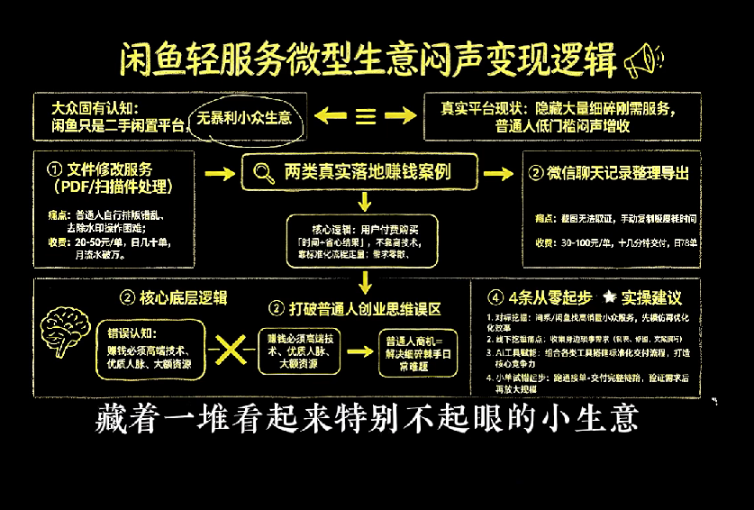

# 闲鱼小生意案例与微型服务逻辑
https://www.xiaohongshu.com/explore/6a33b38f000000000f0159ec

> 关键词：闲鱼运营、电商选品、电商运营、微型服务、AI 工具变现

## 核心观点

很多人以为闲鱼只是一个二手交易平台，但实际上，它也是普通人发现细碎需求、提供标准化服务、实现小规模变现的地方。

平台上有不少看起来不起眼的小生意，客单价不高，却因为需求真实、高频、交付快，能够持续赚钱。

这些生意的共同点是：

- 需求零散但真实存在；
- 用户自己处理很麻烦；
- 服务者掌握固定流程后可以快速交付；
- 单价不高，但靠咨询频次和订单量积累收益；
- 用户付费买的不是复杂技术，而是省时间、省心和最终结果。

## 案例一：PDF 文字修改服务

### 需求场景

很多人以为修改 PDF 用 WPS 就能完成，但实际操作时经常遇到这些问题：

- 字体不一致；
- 行距错乱；
- 扫描件无法直接编辑；
- 文件带水印；
- 企业文件格式要求高；
- 普通用户不知道如何保持原版式。

### 闲鱼上的服务方式

有人专门提供 PDF 修改服务，按次收费。

常见价格区间：

- 单次修改：20-50 元；
- 复杂文件或加急处理：可进一步加价。

### 收益逻辑

这种服务单价不高，但需求高频。熟练掌握工具和流程后，单次交付时间很短。如果一天能接几十单，月流水可以轻松过万。

## 案例二：微信聊天记录整理成文档

### 需求场景

微信聊天记录在很多场景中需要整理成可读文档，例如：

- 业务对接记录；
- 合同纠纷；
- 律师取证；
- 客户沟通归档；
- 项目过程复盘。

截图虽然方便，但在正式场景中往往不够清晰、不可检索，也不适合直接提交或归档。手动复制几百条消息又非常耗时。

### 闲鱼上的服务方式

有人提供聊天记录整理服务，将聊天内容导出、排版、整理成可读文档。

常见收费方式：

- 按条数收费；
- 按页数收费；
- 按整理复杂度收费。

常见价格区间：

- 单单 30-100 元；
- 熟练后十几分钟即可完成；
- 一天接 7-8 单比较常见。

## 这类生意的底层逻辑

这类微型服务并不依赖高精尖技术，而是依赖“流程熟练度”和“结果交付能力”。

用户遇到的问题通常是：

- 自己做太耗时间；
- 不知道用什么工具；
- 试错成本高；
- 做出来格式不够专业；
- 临时有需求，希望有人快速解决。

服务者的价值在于：

- 吃透操作流程；
- 借助工具提高效率；
- 把复杂步骤标准化；
- 用更短时间交付可用结果；
- 帮用户省下时间和精力。

用户付费购买的不是复杂技术，而是：

- 节省时间；
- 减少试错；
- 省心省力；
- 得到规整、可用的最终文件。

## 常见创业误区

很多人以为赚钱必须具备：

- 高精尖技术；
- 稀缺资源；
- 强人脉；
- 大资金；
- 创新项目。

但现实中，普通人的很多消费支出，都花在解决一件件细碎、棘手、不得不处理的日常问题上。

所以普通人做微型服务，不一定要追求宏大的项目，而是可以从这些“小麻烦”切入。

## 微型服务的选品标准

一个适合做成闲鱼服务的小生意，通常具备以下特征：

- 用户确实有痛点；
- 用户自己做起来麻烦；
- 服务者可以用工具快速完成；
- 交付结果清晰可验收；
- 客单价虽然不高，但需求频次高；
- 流程可以标准化、复制化；
- 不依赖重资产；
- 一个人、一台电脑即可跑通闭环。

## AI 工具带来的机会

现在 AI 工具普及，进一步降低了交付成本。

很多过去需要手动处理的任务，现在可以借助 AI 和自动化工具完成，例如：

- 文档整理；
- 表格清洗；
- 图片修复；
- 文案生成；
- 内容摘要；
- 格式转换；
- 资料归档；
- 客服话术生成。

但需要注意的是：AI 降低的是交付成本，不会自动创造需求。真正有价值的是把 AI 工具组合成一条稳定的交付流程。

未来这类微型生意会越来越多，方向就是：

> 盯住高频、琐碎、用户不愿意自己处理的小需求，用工具把它做成标准化服务产品。

## 行动建议

### 1. 去闲鱼和淘宝观察不起眼的服务

重点看那些销量高但看起来不起眼的服务类商品。

这些服务背后往往就是真实痛点。

你不需要一开始就创新，可以先：

- 模仿现有服务；
- 拆解对方交付内容；
- 优化效率；
- 优化文案；
- 优化响应速度；
- 做出更清晰的交付标准。

### 2. 问身边人最近有什么不得不做的琐事

可以重点观察这些需求：

- 整理文件；
- 调整表格；
- 修改 PDF；
- 修图；
- 抠图；
- 排版；
- 写短文案；
- 整理聊天记录；
- 整理票据；
- 制作简单模板。

只要有人觉得麻烦，但你能快速搞定，就有收费的可能。

### 3. 善用 AI 工具组合交付流程

不一定需要写代码，只需要知道每个工具能解决什么问题。

你的竞争力来自于：

- 知道用什么工具；
- 知道工具之间如何组合；
- 知道如何把输入变成稳定输出；
- 知道如何把服务包装成标准产品；
- 知道如何降低沟通成本和交付成本。

## 可延伸的闲鱼微型服务方向

- PDF 修改与格式修复；
- 扫描件转可编辑文档；
- 微信聊天记录整理；
- Excel 表格清洗与汇总；
- 图片修复、抠图、去水印；
- 简历排版与优化；
- 合同 / 文件格式整理；
- 会议录音转文字与纪要整理；
- 小红书 / 闲鱼商品文案优化；
- 闲鱼商品标题关键词优化；
- 企业资料归档整理；
- 数据录入与格式转换。

## 总结

闲鱼上的微型服务，本质不是卖复杂技术，而是卖“帮用户省时间”。

找到一个被大多数人忽略、但确实有人头疼的小麻烦，再用可复制的流程去解决它，就有机会做成一个小而稳的生意。

一个人、一台电脑、一个标准化交付流程，就可以开始测试。
